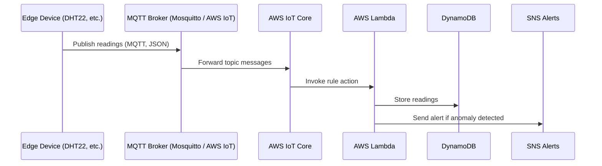

# 🌐 Smart Edge–Cloud Monitor

**Your Environment, Monitored — From the Edge to the Cloud**  
[](LICENSE)  
[]()  
[]()

---

## 📖 Overview

The Smart Edge–Cloud Monitor is an IoT system designed to collect real-time environmental data (temperature and humidity) using a Raspberry Pi, and send this data securely to AWS cloud infrastructure for monitoring, logging, and future analysis.

---

## 🌟 Features

- 📡 Sensor-to-Cloud Data Streaming (DHT22 → Pi → AWS IoT Core)
- 🌤 Real-Time Temperature and Humidity Monitoring
- ☁️ Secure Communication over MQTT
- 🗂️ Local Logging with Cloud Sync
- 📊 Cloud Storage with AWS DynamoDB (MVP)
- 📡 Planned Visualization via Web Dashboard

---

## 📁 Project Structure

```bash
smart-edge-cloud-monitor/
├── src/                    # Main application code (Python)
│   └── main.py
├── docs/                   # Documentation
│   ├── PID.txt             # Project Initiation Document
│   └── TDD.txt             # Technical Design Document
├── test/                   # Unit tests and test data
├── hardware/               # Wiring diagrams and pin mappings
├── requirements.txt        # Edge device dependencies
├── requirements-dev.txt    # Local development + CI dependencies
├── lambda_requirements.txt # AWS Lambda deployment dependencies
├── lambda_local_requirements.txt # AWS Lambda local test dependencies
├── .gitignore
├── LICENSE
└── README.md               # This file
```

---

## 🚀 Getting Started

### ✅ Prerequisites
- Raspberry Pi 4 or 5 (with Raspberry Pi OS 64-bit)
- Python 3.9+ installed
- Internet connectivity (Wi-Fi or Ethernet)
- AWS Account + IAM permissions for IoT Core & DynamoDB

### 💻 Clone the Repository
```bash
git clone https://github.com/chrisdudley-dev/smart-edge-cloud-monitor.git
cd smart-edge-cloud-monitor
```

### 🧪 Create Virtual Environment
#### Windows
```powershell
python -m venv venv
venv\Scripts\activate
```
#### macOS / Linux
```bash
python3 -m venv venv
source venv/bin/activate
```

---

### 📦 Install Dependencies

**For Local Development / CI**  
Includes runtime + testing, linting, and analysis tools.
```bash
pip install -r requirements-dev.txt
```

**For Raspberry Pi Edge Device**  
Minimal runtime dependencies for the Pi itself.  
If using legacy `RPi.GPIO` + `Adafruit_DHT`, uncomment those lines in `requirements.txt` before installing.
```bash
pip install -r requirements.txt
```

**For AWS Lambda Deployment**  
Keep `lambda_requirements.txt` minimal (often empty). Add only extra packages your Lambda handler imports.
```bash
pip install -r lambda_requirements.txt
```

**For Local Testing of Lambda Functions**  
Matches Lambda’s runtime libraries (including boto3/botocore).
```bash
pip install -r lambda_local_requirements.txt
```

---

## 🔍 Usage Example

```bash
python src/main.py
```

Expected Output:
```json
{
  "timestamp": "2025-08-06T22:11:03Z",
  "temperature_C": 24.6,
  "humidity": 52.4,
  "device_id": "edge-node-001"
}
```

---

## 🧠 System Overview

## Architecture

**Variant A — Mosquitto bridge**  


**Variant B — Direct to AWS**  


### Data Flow Sequence



> The dashed OTA/config (Jobs/Shadow) path is included in both variants.

> 📌 Sensor Wiring Diagram (Coming Soon)

---

## 🛣 Roadmap

- [x] Create project structure and GitHub repo
- [x] Draft PID and TDD
- [x] Write README scaffold
- [x] Add modular dependency files for edge, Lambda, and local dev
- [ ] Integrate DHT22 sensor
- [ ] Implement local data logging
- [ ] Configure AWS IoT Core & DynamoDB
- [ ] Set up MQTT broker
- [ ] Add error handling and edge buffering
- [ ] Finalize unit testing suite
- [ ] Add web-based dashboard (stretch goal)

---

## 📚 Documentation

- [📄 Project Initiation Document (PID)](docs/PID.txt)
- [📄 Technical Design Document (TDD)](docs/TDD.txt)

---

## 🤝 Contributing

Want to contribute? Awesome!  
Help us improve by forking the repo and submitting a pull request.

> CONTRIBUTING.md coming soon...

---

## 📬 Contact

- Chris Dudley – [GitHub](https://github.com/chrisdudley-dev)

---

## 📝 License

This project is licensed under the [Apache 2.0 License](LICENSE).
